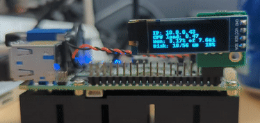

## Overview

oleddisplaystats is a cross platform python3 script to display system statistics on an i2c based OLED display. It currently is tested to run on [Raspberry Pi 4 B](https://www.raspberrypi.com/products/raspberry-pi-4-model-b/), [Raspberry Pi Compute Module 4](https://www.raspberrypi.com/products/compute-module-4/?variant=raspberry-pi-cm4001000), [Banana Pi BPI-CM4 computer module](https://wiki.banana-pi.org/Banana_Pi_BPI-CM4)and the [UP Board UP 4000](https://up-board.org/up-4000/).

<br/>
**oleddisplaystats script running on a BananaPi BPI-CM4 computer module**

<br/>
**oleddisplaystats script running on an Up Board UP4000**

## Description

A while back I created a DEB installation package to automate the install of a python3 script to display ststem statistics on a 132x64 OLED display on a Raspberry Pi - (displaypistats)[https://displaypistats.loonix.ca].

In the meantime I started to play around with the [Banana Pi BPI-CM4 computer module](https://wiki.banana-pi.org/Banana_Pi_BPI-CM4)and the [UP Board UP 4000](https://up-board.org/up-4000/).

Although the BPI-CM4 is compatible with the Raspberry Pi Compute Module 4, the way I2C is enabled differs from the Raspberry Pi so I the installation via the DEB package I created did not work on the BPI-CM4. The UP4000 is Intel based and the package did not work either.

I set out to rewrite the script to be compatible with all the boards I was playing around with. THe biggest challenge was to find the right pyhon pip module to control the i2c OLED with.

The original script used the board and busio modules which were not compatible with the BPI-CM4 and UP4000. After a long search I found the smbus2 library which seemed to work on the Raspberry Pi, UP4000 and BPI-CM4.

I had to create a custom i2c class to be fully compatible with the old python code I had put together.

## Enhancements

My orignal script, similar to the (one)[https://bit.ly/3rjHarP] I modified it from was a static script displaying the following:

- IP address on line one of the OLED
- CPU load on line three of the OLED
- Memroy usage and total memory of the device on line three of the OLED
- Disk usage and total disk space of the device on line four of the OLED

I always wanted to also display the hostname on the display but the deisplay is small and limited to the amount of data that can be displayed.

So I was thinking if I could alternate displaying the IP address and the hostname on line one of the OLED I could increase the system information being displayed on the OLED.  

## Installation

1. Copy the script below to a folder on your device; for example /usr/local/etc/
2. add '/usr/bin/python3 /usr/local/etc/oleddisplaystats &' to rc.local

Maybe someday when I have time I will come up with a multi-platform DEB installation package.


## The python script that displays the stats on the OLED

```python
#!/usr/bin/python3
import smbus2
from smbus2 import i2c_msg
from PIL import Image, ImageDraw, ImageFont
import adafruit_ssd1306
import subprocess
import time

class CustomI2C:
    def __init__(self, bus_number):
        self.bus = smbus2.SMBus(bus_number)

    def readfrom_into(self, address, buffer):
        read = i2c_msg.read(address, len(buffer))
        self.bus.i2c_rdwr(read)
        for i, value in enumerate(list(read)):
            buffer[i] = value

    def writeto(self, address, buffer, start=0, end=None):
        if end is None:
            end = len(buffer)
        buffer = buffer[start:end]
        if not buffer:
            return  # Ignore empty buffers
        write = i2c_msg.write(address, buffer)
        self.bus.i2c_rdwr(write)

    def try_lock(self):
        return True

    def unlock(self):
        pass
#This is the i2c bus number the OLED is connected to - it can be retrieved via i2cdetect -y -r [x] where x is the bus
bus_number = 1

# This is the pixel hight and width of the OLED display
width = 128
height = 32

# Create the custom I2C interface using the smbus2 library
i2c = CustomI2C(bus_number)

# Create an SSD1306 OLED class instance with a 128x32 display
disp = adafruit_ssd1306.SSD1306_I2C(width, height, i2c)

#Display rotation - should be a value of 0, 1, 2 or 3 only, where 0 is no rotation (default), 1 is rotate 90° clockwise, 2 is 180° rotation and 3 represents 270° rotation.
#disp.rotation = 2

# Clear the display
disp.fill(0)
disp.show()

# Create a blank image for drawing
image = Image.new("1", (disp.width, disp.height))
draw = ImageDraw.Draw(image)

# Draw some shapes.
# First define some constants to allow easy resizing of shapes.
padding = -2
top = padding
bottom = height - padding
# Move left to right keeping track of the current x position for drawing shapes.
x = 0

# Load default font.
font = ImageFont.load_default()

# Alternatively load a TTF font.  Make sure the .ttf font file is in the
# same directory as the python script!
# Some other nice fonts to try: http://www.dafont.com/bitmap.php
# font = ImageFont.truetype('/usr/share/fonts/truetype/dejavu/DejaVuSans.ttf', 9)

counter = 0  # Add a counter variable

while True:
    # Draw a black filled box to clear the image.
    draw.rectangle((0, 0, width, height), outline=0, fill=0)

    # Shell scripts for system monitoring from here:
    cmd = "hostname -I | cut -d' ' -f1"
    IP = subprocess.check_output(cmd, shell=True).decode("utf-8")
    cmd = 'cut -f 1 -d " " /proc/loadavg'
    CPU = subprocess.check_output(cmd, shell=True).decode("utf-8")
    cmd = "free -m | awk 'NR==2{printf \"Mem: %.2f%% of \" ,$3*100/$2}' && free -hm | awk 'NR==2{printf \"%s\", $2}'"
    MemUsage = subprocess.check_output(cmd, shell=True).decode("utf-8")
    cmd = 'df -h | awk \'$NF=="/"{printf "Disk: %d/%d GB  %s", $3,$2,$5}\''
    Disk = subprocess.check_output(cmd, shell=True).decode("utf-8")

    if (counter // 50) % 2 == 0:  # Alternate every 5 seconds (50 iterations)
        draw.text((x, top + 0), "IP: " + IP, font=font, fill=255)
    else:
        cmd = "hostname"
        Hostname = subprocess.check_output(cmd, shell=True).decode("utf-8")
        draw.text((x, top + 0), "HN: " + Hostname, font=font, fill=255)

    draw.text((x, top + 8), "CPU load: " + CPU, font=font, fill=255)
    draw.text((x, top + 16), MemUsage, font=font, fill=255)
    draw.text((x, top + 25), Disk, font=font, fill=255)

    # Display image.
    disp.image(image)
    disp.show()
    time.sleep(0.1)

    counter += 1  # Increment the counter
```